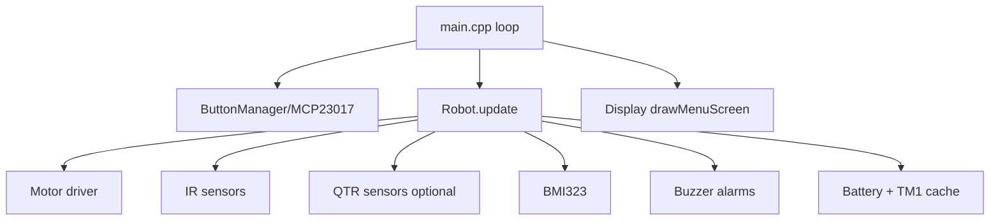

# SumoV2 Project Architecture

This document reflects the current firmware behavior on branch `IMU-changes`.

## System Overview

- `src/main.cpp` runs the scheduler and menu rendering.
- `src/robot.cpp` owns behavior logic, strategy dispatch, diagnostics motor test, battery/temperature cache, and buzzer logic.
- Subsystems are isolated: `Motor`, `IRSensors`, `QTRSensors`, `IMU`, `Display`, `ButtonManager`, `HeadingController`.

## Scheduler and Timing

- Control task: `2 ms` (`CONTROL_TASK_INTERVAL_MS`).
- UI redraw task: `30 ms` (`UI_TASK_INTERVAL_MS`).
- Shared ADC cache refresh: `1000 ms` (`ADC_CACHE_INTERVAL_MS`).
- I2C clock: `400 kHz` (`Wire.setClock(400000)`).
- Motor PWM: 8-bit range `0..255`, frequency `5 kHz`.

## Menu Screens (Current Order)

Defined in `include/menu.h`:

- `MENU_SCREEN_IR = 0`
- `MENU_SCREEN_SPEED = 1`
- `MENU_SCREEN_STRATEGY = 2`
- `MENU_SCREEN_BATTERY = 3` (merged diagnostics page)
- `MENU_SCREEN_DIRECTION = 4`
- `MENU_SCREEN_MAIN = 5`

Total: `MENU_SCREEN_COUNT = 6`.

## Diagnostics Screen

`MENU_SCREEN_BATTERY` now serves as diagnostics:

- Default diagnostics view: centered title (`diagnostics`) + two large lines.
- Line 1 shows battery voltage (`xx.xx V`).
- Line 2 shows temperature (`xx.x C` or `N/A C`).
- Press `k` while on diagnostics to enter motor test submenu.
- Motor test submenu options:
  `forward`, `backward`, `right`, `left`.
- While motor test is active:
  `j`/`k` changes selection, selected action runs continuously in
  `updateBehavior_DiagnosticsMotorTest()`, and `h` or `l` exits test mode.

## Keypad Mapping

Via MCP23X17:

- `h`: previous screen (or exit motor test)
- `l`: next screen (or exit motor test)
- `j`: decrement/cycle backward (speed, strategy, or motor test option)
- `k`: increment/cycle forward (speed, strategy, enter/cycle motor test)

## Strategy Behavior Summary

- `STRATEGY_STING`
  center sensor attacks forward; left/right detections commit turns for
  `50 ms` (`STING_TURN_COMMIT_MS`).
- `STRATEGY_SPEED`
  aggressive IR-based forward/turn behavior.
- `STRATEGY_RUN`
  retreat-style behavior.
- `STRATEGY_IMU_HOLD`
  straight start routine only (`550 ms`), IR + IMU heading hold with PID,
  short recoil before attack lock (`40 ms`, `IMU_ATTACK_RECOIL_MS`), and
  search/evasion/edge-recovery state machine.

## Sensors and Feature Flags

- IR sensors: 3 digital inputs with debounce (`DEBOUNCE_THRESHOLD = 3`).
- QTR edge sensors: optional and compile-time gated.
  `ENABLE_QTR_LINE_SENSORS = 0` by default.
- IMU availability is probed at startup; robot continues if IMU init fails.

## Battery and Temperature Pipeline

- Battery from GP28 (`VLEVEL`) via divider.
- Temperature from GP26 (`TM1`, NTC model).
- Readings are cached and reused between cache intervals.
- Current battery conversion in code:
  `Vadc = raw / 4095 * 3.3`; `Vbat = max(0, (Vadc + 0.12)) * 6.6`.

## Buzzer Alerts

- `< 6.0V`: alarms disabled/reset (USB-floor protection).
- crossing below `12.2V`: warning pattern (3 beeps, 500 ms transitions).
- `< 11.3V`: continuous alarm.

## Notes

- `MODE_RUNNING` exists but normal operation is effectively menu-driven + behavior update.
- `updateMelody()` is still called in loop; startup `playMelody()` is currently commented out in `Robot::setup()`.
- `StartRoutine` enum remains but only `START_ROUTINE_STRAIGHT` is used.
