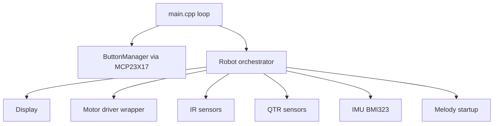
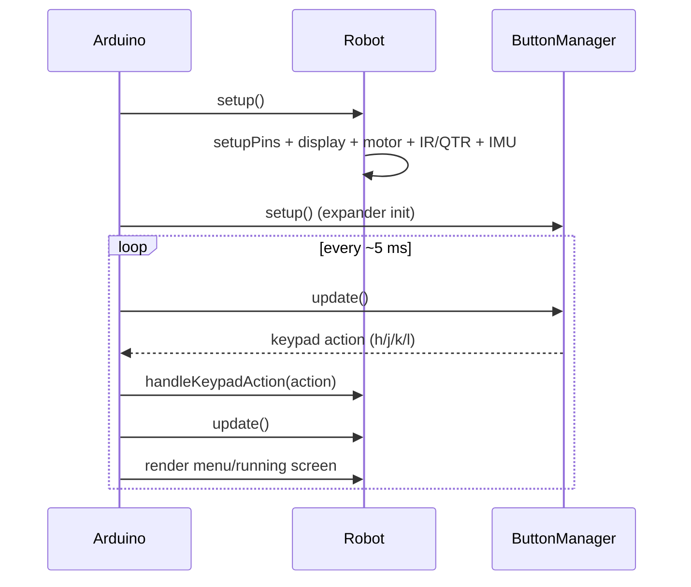
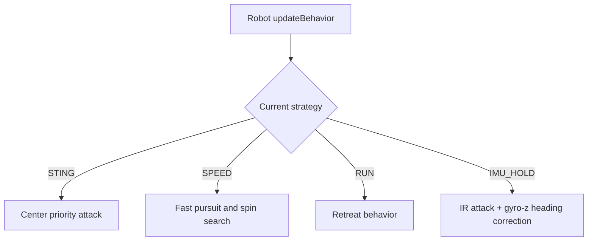

# SumoV2 Project Architecture

SumoV2 now follows the same high-level structure as MiniSumo2026:

- `main.cpp` handles the top-level loop only.
- `Robot` is the orchestrator for setup, update, and strategy dispatch.
- `Motor`, `IR`, `QTR`, `Display`, `ButtonManager`, and `IMU` are isolated subsystems.
- `ButtonManager` reads keypad events from the IO expander while other expander pins remain generic inputs.

## System Overview

## Setup and Loop Flow

## Strategy Dispatch

## Runtime Mode Notes

- `MODE_MENU`: user navigates screens and changes speed/strategy.
- `MODE_PAUSED`: motors are stopped.
- `MODE_RUNNING`: active behavior loop (ready for expansion).
- Includes a dedicated battery voltage menu screen (`MENU_SCREEN_BATTERY`).
- Includes a dedicated temperature menu screen (`MENU_SCREEN_TEMP`, source: `TM1` pin).

## Pin Policy

This repo keeps mixed-valid mapping on purpose:

- Discrete motor-driver pins (`ENM1/ENM2/PWM1/PWM2/DIR1/DIR2`) are used by the new `Motor` class.
- Legacy `PWM_Ax/PWM_Bx/N_SLEEP` defines are kept in `pins.h` for compatibility and future profile switching.
- Expander channels are modeled as generic pins (`EXP_PIN_0..EXP_PIN_7`) with explicit keypad aliases in `defines.h`.
- Current sense lines (`CS_1`, `CS_2`) are read through the MCP23017 expander inputs, not direct Pico ADC pins.

## Full PCB Docs

The full net mapping used by firmware is documented in `docs/PCB_SCHEMATIC_MAP.md`.
