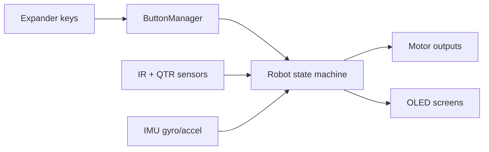

# SumoV2 Quick Reference

## Control Mapping (Current)

- Vim-style keypad mode (`h j k l`):
- `h` (MCP pin 4): previous menu screen
- `l` (MCP pin 3): next menu screen
- `j` (MCP pin 5): decrease selected value (speed/strategy)
- `k` (MCP pin 2): increase selected value (speed/strategy)

Other MCP23X17 channels are treated as expander inputs, not keypad keys:

- MCP pin 1: `INPUT_IR6_PIN`
- MCP pin 6: `INPUT_CS_1_PIN`
- MCP pin 7: `INPUT_CS_2_PIN`

## Current Sense Formula (Pololu 2995)

For this PCB revision, current sense is routed through the MCP23017 (`INPUT_CS_1_PIN`, `INPUT_CS_2_PIN`) and is only requested when the current or peak-current menu screens are opened.

- This keeps the fast control loop from paying the current-sense cost every cycle.
- Current values remain cached until the next request.

This avoids extra loop overhead when current information is not on screen.

## Battery Voltage Formula

Battery monitor divider from schematic:

- top resistor `R25 = 56k`
- bottom resistor `R26 = 10k`
- `Vadc = Vbat * (10 / 66)`
- calibrated firmware model currently used in code: `Vbat = max(0, (Vadc + 0.12)) * 6.6`

The battery menu screen displays live voltage and an approximate 3S percentage at `MENU_SCREEN_BATTERY`.

Battery and temperature ADC values are cached and refreshed every `1000 ms` (`ADC_CACHE_INTERVAL_MS`).

## Battery Buzzer Alerts

- Below `6.0V`: buzzer alerts are disabled and reset, so USB power does not trigger warnings.
- Crossing below `12.2V`: warning pattern of `3` beeps, each `500ms`.
- Below `11.3V`: continuous buzzer alarm.

## Temperature Screen

- Temperature monitor net `TM1` is sampled on Pico `GP26` (`TEMP_MONITOR_PIN`).
- Menu screen: `MENU_SCREEN_TEMP`.
- Display shows estimated `C` and raw TM1 voltage.

## Full PCB Mapping

See `docs/PCB_SCHEMATIC_MAP.md` for the consolidated whole-board net map.

## Strategy List

- `STING`: center sensor has priority for direct attack.
- `SPEED`: aggressive search and attack.
- `RUN`: reverse/retreat behavior when target is detected.
- `IMU_HOLD`: adds gyro-z based heading correction when target is not centered.

## Speed Tuning

Speed presets are in `include/menu.h` (`SPEED_PRESETS`).

- `attack`: forward/engage speed
- `search`: no-target search speed
- `turn_moderate`, `turn_gentle`: turning speeds

## How to Change Behavior Quickly

1. Change strategy constants and presets in `include/menu.h`.
2. Edit strategy logic in `src/robot.cpp`:
   - `updateBehavior_Sting()`
   - `updateBehavior_Speed()`
   - `updateBehavior_Run()`
   - `updateBehavior_IMUHold()`
3. If motor direction is inverted on hardware, adjust `Motor::drive()` direction flags in `src/motors.cpp`.
4. If pin routing changes between PCBs, update `include/pins.h` only.

## Runtime Cadence and Tuning

- Control task runs every `2 ms` (`CONTROL_TASK_INTERVAL_MS`).
- UI redraw task runs every `30 ms` (`UI_TASK_INTERVAL_MS`).
- Melody playback is non-blocking and progresses via `updateMelody()`.
- I2C is configured to `400 kHz` after startup.
- Motor PWM is configured to `5 kHz` with 8-bit range (`0..255`).

## Fault Tolerance

- If MCP23017 expander init fails, firmware skips keypad reads and continues running.
- Expander interrupt checks return no event while unavailable instead of halting the robot.

## Debug Gates

- `DEBUG_ROBOT_BOOT`
- `DEBUG_IMU_INIT`
- `DEBUG_IMU_RUNTIME`
- `DEBUG_I2C_ERRORS`

## Competition Mode (Match Day)

Use this checklist before a real match to minimize noise and runtime overhead:

1. Disable all debug output in `include/defines.h`:
   - `DEBUG_ROBOT_BOOT = 0`
   - `DEBUG_IMU_INIT = 0`
   - `DEBUG_IMU_RUNTIME = 0`
   - `DEBUG_I2C_ERRORS = 0`
2. Keep scheduler cadence at current tuned values:
   - `CONTROL_TASK_INTERVAL_MS = 2`
   - `UI_TASK_INTERVAL_MS = 30`
   - `ADC_CACHE_INTERVAL_MS = 1000`
3. Keep motor PWM at `5 kHz` unless motor heat/noise testing suggests otherwise.
4. Keep I2C at `400 kHz` if stable on your board.
5. If I2C communication glitches appear under match conditions, temporarily drop to `100 kHz` in `Robot::setup()` (`Wire.setClock(100000)`) for maximum bus margin.
6. If you want completely silent startup, disable melody start from robot setup (or gate it with a compile-time flag).

## Data/Control Diagram

