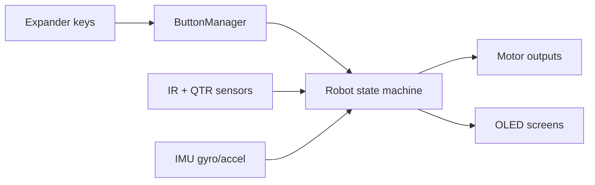

# SumoV2 Quick Reference

## Control Mapping (Current)

- Keypad key 1 (MCP pin 4): cycle menu screen
- Keypad key 2 (MCP pin 5): cycle speed (on speed screen) or strategy (on strategy screen)
- Keypad key 3 (MCP pin 2): pause/resume
- Keypad key 4 (MCP pin 3): currently unassigned

Other MCP23X17 channels are treated as expander inputs, not keypad keys:

- MCP pin 1: `INPUT_IR6_PIN`
- MCP pin 6: `INPUT_CS_1_PIN`
- MCP pin 7: `INPUT_CS_2_PIN`

## Strategy List

- `STING`: center sensor has priority for direct attack.
- `SPEED`: aggressive search and attack.
- `RUN`: reverse/retreat behavior when target is detected.
- `IMU_HOLD`: adds gyro-z based heading correction when target is not centered.

## Speed Tuning

Speed presets are in `include/menu.h` (`SPEED_PRESETS`).

- `attack`: forward/engage speed
- `search`: no-target search speed
- `turn_moderate`, `turn_gentle`: turning speeds

## How to Change Behavior Quickly

1. Change strategy constants and presets in `include/menu.h`.
2. Edit strategy logic in `src/robot.cpp`:
   - `updateBehavior_Sting()`
   - `updateBehavior_Speed()`
   - `updateBehavior_Run()`
   - `updateBehavior_IMUHold()`
3. If motor direction is inverted on hardware, adjust `Motor::drive()` direction flags in `src/motors.cpp`.
4. If pin routing changes between PCBs, update `include/pins.h` only.

## Data/Control Diagram

