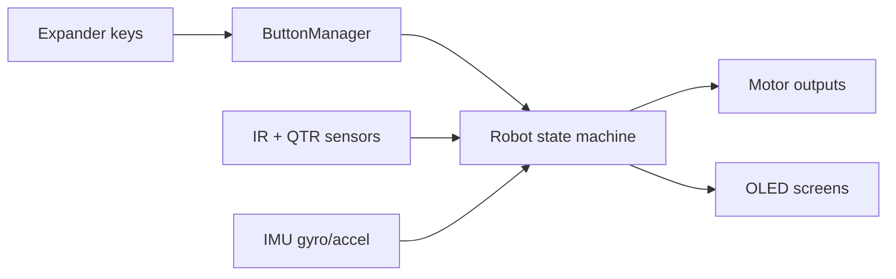

# SumoV2 Quick Reference

## Control Mapping (Current)

- Vim-style keypad mode (`h j k l`):
- `h` (MCP pin 4): previous menu screen
- `l` (MCP pin 3): next menu screen
- `j` (MCP pin 5): decrease selected value (speed/strategy)
- `k` (MCP pin 2): increase selected value (speed/strategy)

Other MCP23X17 channels are treated as expander inputs, not keypad keys:

- MCP pin 1: `INPUT_IR6_PIN`
- MCP pin 6: `INPUT_CS_1_PIN`
- MCP pin 7: `INPUT_CS_2_PIN`

## Current Sense Formula (Pololu 2995)

Current now uses the CS transfer function from the Pololu G2 24v21 page:

- `Vcs ~= 0.020 * I + 0.050` (V)
- `I = max(0, (Vcs - 0.050) / 0.020)`

Where `Vcs` is the ADC-converted CS pin voltage.

## Battery Voltage Formula

Battery monitor divider from schematic:

- top resistor `R25 = 56k`
- bottom resistor `R26 = 10k`
- `Vadc = Vbat * (10 / 66)`
- `Vbat = Vadc * 6.6`

The battery menu screen displays live voltage and an approximate 3S percentage at `MENU_SCREEN_BATTERY`.

## Strategy List

- `STING`: center sensor has priority for direct attack.
- `SPEED`: aggressive search and attack.
- `RUN`: reverse/retreat behavior when target is detected.
- `IMU_HOLD`: adds gyro-z based heading correction when target is not centered.

## Speed Tuning

Speed presets are in `include/menu.h` (`SPEED_PRESETS`).

- `attack`: forward/engage speed
- `search`: no-target search speed
- `turn_moderate`, `turn_gentle`: turning speeds

## How to Change Behavior Quickly

1. Change strategy constants and presets in `include/menu.h`.
2. Edit strategy logic in `src/robot.cpp`:
   - `updateBehavior_Sting()`
   - `updateBehavior_Speed()`
   - `updateBehavior_Run()`
   - `updateBehavior_IMUHold()`
3. If motor direction is inverted on hardware, adjust `Motor::drive()` direction flags in `src/motors.cpp`.
4. If pin routing changes between PCBs, update `include/pins.h` only.

## Data/Control Diagram

